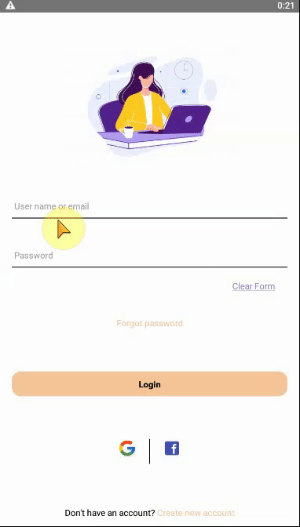
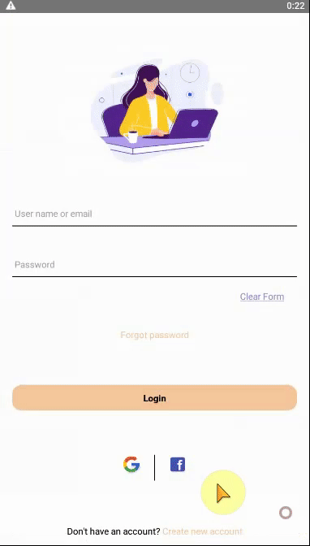
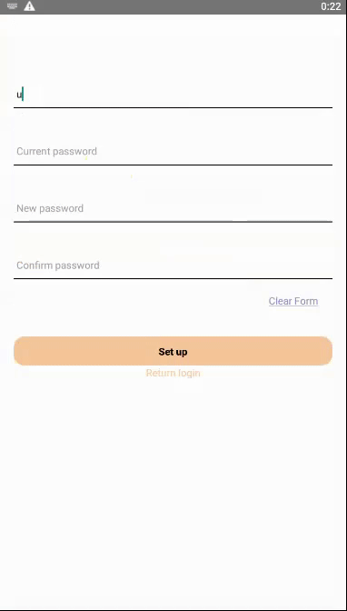
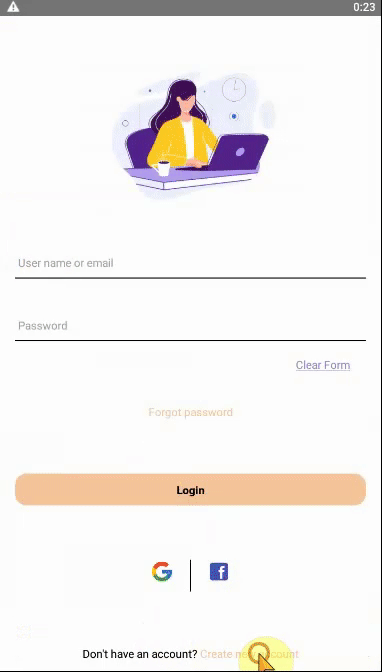
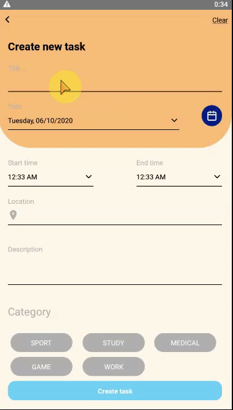

# To do list App
* Phạm Thị Thúy
* Các tác vụ đã làm:
* Login:
- Đăng nhập với email: user@gmail.com và password: userpw
- Khi không điền tất cả các trường hoặc nhập sai một trường sẽ hiển thị cảnh báo ở đầu màn hình

* Quên mật khẩu:
- Người dùng nhập email mà cần lấy lại mật khẩu, phải điền đúng mã xác thực để lấy lại mật khẩu

* Đặt lại mật khẩu:
- Người dùng điền email, mật khẩu hiện tại và mật khẩu mới muốn đổi vào form

* Đăng kí tài khoản:
- Người dùng điền đủ các trường email, họ tên, tên người dùng, mật khẩu và xác nhận

* Thêm tác vụ:
- Người dùng điền tên tác vụ, thời gian thực hiện, nơi thực hiện, chủ đề, mô tả tác vụ

